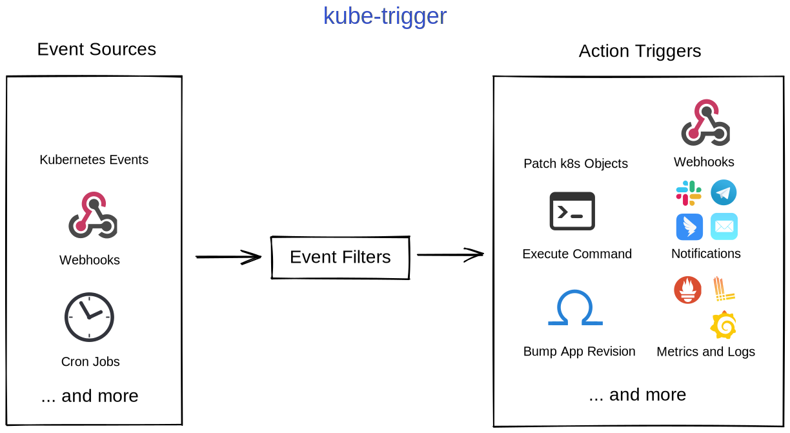

# kube-trigger

kube-trigger is a tool that combines event listeners and action triggers.



## Overview

Although there is `kube` in the name, it is actually not limited to Kubernetes and can do much more than that. It has an
extensible architecture that can extend its capabilities fairly easily. We have docs (not yet) on how to
extend [Sources](#Sources), [Filters](#Filters), and [Actions](#Actions). All users are welcomed to contribute their own
extensions.

### Sources

A Source is what listens to events (event source). For example, a `k8s-resource-watcher` source can watch Kubernetes
resources. Once a Kubernetes resource (e.g. ConfigMap) is changed, it will raise an event that will be passed
to [Filters](#Filters) for further processing.

### Filters

A Filter will filter the events that are raised by [Sources](#Sources), i.e, drop events that do not satisfy a certain
criteria. For example, users can use a `cue-validator` Filter to filter out events by Kubernetes resource names. All the
events that passed the Filters will then trigger an [Action](#Actions).

### Actions

An Action is a job that does what the user specified when an event happens. For example, the user can send
notifications, log events, execute a command, or patch some Kubernetes objects when an event happens.

## Quick Start

To quickly know the concepts of kube-trigger, let's use a real use-case as an exmaple (
see [#4418](https://github.com/kubevela/kubevela/issues/4418)). TL;DR, the user want the Application to be automatically
updated whenever the ConfigMaps that are referenced by `ref-objects` are updated.

To accomplish this, we will:

- use a `k8s-resource-watcher` Source to listen to update events of ConfigMaps
- use a `cue-validator` Filter to only keep the ConfigMaps that we are interested in
- trigger an `bump-application-revision` Action to update Application.

See [examples](https://github.com/kubevela/kube-trigger/tree/main/examples) directory for instructions.

## Configuration File

A config file instructs kube-trigger to use what [Sources](#Sources), [Filters](#Filters), and [Actions](#Actions), and
how they are configured.

No matter you are running kube-trigger as standalone or in-cluster, the config format is similar, so it is beneficial to
know the format first. We will use yaml format as an example (json and cue are also supported).

```yaml
# A Watcher is a group of 
#   - one Source
#   - multiple Filters
#   - multiple Actions
# You can add multiple Watchers. They will run simultaneously.
watchers:
  - source: # One Source
      # Which Source? (What type of event Source do you want?)
      type: k8s-resource-watcher
      # Source-specific configuration. Refer to each Source for details.
      # For example, we can tell k8s-resource-watcher what resources to watch.
      properties:
      # ...
    filters: # An array of Filters
      # What Filters to use? They will be logically ANDed together.
      - type: cue-validator
        # Filter-specific configuration. Refer to each Filter for details.
        properties:
        # ...
    actions: # An array of Actions
      # What Actions to use? They all of them will be executed when an event happens.
      - type: bump-application-revision
        # Action-specific configuration. Refer to each Action for details.
        properties:
        # ...

```

### Standalone

When running in standalone mode, you will need to provide a config file to kube-trigger binary.

kube-trigger can accept `cue`, `yaml`, and `json` config files. You can also specify a directory to load all the
supported files inside that directory. `-c`/`--config` cli flag and `CONFIG` environment variable can be used to specify
config file.

An example config file looks like this:

```yaml
# A Watcher is a group of Source, Filters, and Actions.
# You can add multiple Watchers.
watchers:
  - source:
      # Watch Kubernetes events.
      type: k8s-resource-watcher
      properties:
        # We are interested in ConfigMap events.
        apiVersion: v1
        kind: ConfigMap
        namespace: default
        # Only watch update event.
        events:
          - update
    filters:
      # Filter the events above.
      - type: cue-validator
        properties:
          # Filter by validating the object data using CUE.
          # For example, we are filtering by ConfigMap names (metadata.name) from above.
          # Only ConfigMaps with names that satisfy this regexp "this-will-trigger-update-.*" will be kept.
          template: |
            metadata: name: =~"this-will-trigger-update-.*"
    actions:
      # Bump Application Revision to update Application.
      - type: bump-application-revision
        properties:
          namespace: default
          # Select Applications to bump using labels.
          labelSelectors:
            my-label: my-value

```

Let's assume your config file is `config.yaml`, to run kube-trigger:

- `./kube-trigger -c=config.yaml`
- `CONFIG=config.yaml ./kube-trigger`

### In-Cluster

We have two CRDs: *KubeTrigger* and *KubeTriggerConfig*.

- *KubeTrigger* is what creates a kube-trigger instance (similar to running `./kube-trigger` in-cluster but no config is
  provided). Advanced kube-trigger Instance Configuration (next section) can be provided in it.
- *KubeTriggerConfig* is used to provide one or more configs (same as the config file you use when running as
  standalone) to a *KubeTrigger* instance.

So we know *KubeTriggerConfig* is what actually provides a config, this is what we will be discussing.

```yaml
# You can find this file in config/samples/standard_v1alpha1_kubetriggerconfig.yaml
apiVersion: standard.oam.dev/v1alpha1
kind: KubeTriggerConfig
metadata:
  name: kubetrigger-sample-config
  namespace: default
spec:
  # Provide this config to these (using selectors) KubeTrigger instances.
  # KubeTrigger should be created first, then when you apply this KubeTriggerConfig
  # the KubeTrigger instances selected by selectors will be given the config
  # defined in this file.
  # Label selector (the labels in KubeTrigger).
  selector:
    app: kubetrigger-sample
  # Familiar? This section is exactly the same as what we have seen above.
  watchers:
    - source:
        type: k8s-resource-watcher
        properties:
          apiVersion: "v1"
          kind: ConfigMap
          namespace: default
          events:
            - update
      filters:
        - type: cue-validator
          properties:
            template: |
              // Filter by object name.
              // I used regular expressions here.
              metadata: name: =~"this-will-trigger-update-.*"
      actions:
        - type: bump-application-revision
          properties:
            namespace: default
            labelSelectors:
              my-label: my-value
```

## Advanced kube-trigger Instance Configuration

In addition to config files, you can also do advanced configurations. Advanced kube-trigger Instance Configurations are
internal configurations to fine-tune your kube-trigger instance. In
most cases, you probably don't need to fiddle with these settings.

### Log Level

Frequently-used values: `debug`, `info`, `error`

Default: `info`

| CLI           | ENV         | KubeTrigger CRD |
|---------------|-------------|-----------------|
| `--log-level` | `LOG_LEVEL` | `TODO`          |

### Action Retry

Re-run Action if it fails.

Default: `false`

| CLI              | ENV            | KubeTrigger CRD |
|------------------|----------------|-----------------|
| `--action-retry` | `ACTION_RETRY` | `TODO`          |

### Max Retry

Max retry count if an Action fails, valid only when action retrying is enabled.

Default: `5`

| CLI           | ENV         | KubeTrigger CRD               |
|---------------|-------------|-------------------------------|
| `--max-retry` | `MAX_RETRY` | `.spec.workerConfig.maxRetry` |

### Retry Delay

First delay to retry actions in seconds, subsequent delay will grow exponentially, valid only when action retrying is
enabled.

Default: `2`

| CLI             | ENV           | KubeTrigger CRD                 |
|-----------------|---------------|---------------------------------|
| `--retry-delay` | `RETRY_DELAY` | `.spec.workerConfig.retryDelay` |

### Per-Worker QPS

Long-term QPS limiting per Action worker, this is shared between all watchers.

Default: `2`

| CLI                | ENV              | KubeTrigger CRD                   |
|--------------------|------------------|-----------------------------------|
| `--per-worker-qps` | `PER_WORKER_QPS` | `.spec.workerConfig.perWorkerQPS` |

### Queue Size

Queue size for running actions, this is shared between all watchers

Default: `50`

| CLI            | ENV          | KubeTrigger CRD                |
|----------------|--------------|--------------------------------|
| `--queue-size` | `QUEUE_SIZE` | `.spec.workerConfig.queueSize` |

### Job Timeout

Timeout for running each action in seconds.

Default: `10`

| CLI         | ENV       | KubeTrigger CRD              |
|-------------|-----------|------------------------------|
| `--timeout` | `TIMEOUT` | `.spec.workerConfig.timeout` |

### Worker Count

Number of workers for running actions, this is shared between all watchers.

Default: `4`

| CLI         | ENV       | KubeTrigger CRD                  |
|-------------|-----------|----------------------------------|
| `--workers` | `WORKERS` | `.spec.workerConfig.workerCount` |

### Registry Size

Cache size for filters and actions.

Default: `100`

| CLI               | ENV             | KubeTrigger CRD      |
|-------------------|-----------------|----------------------|
| `--registry-size` | `REGISTRY_SIZE` | `.spec.registrySize` |
